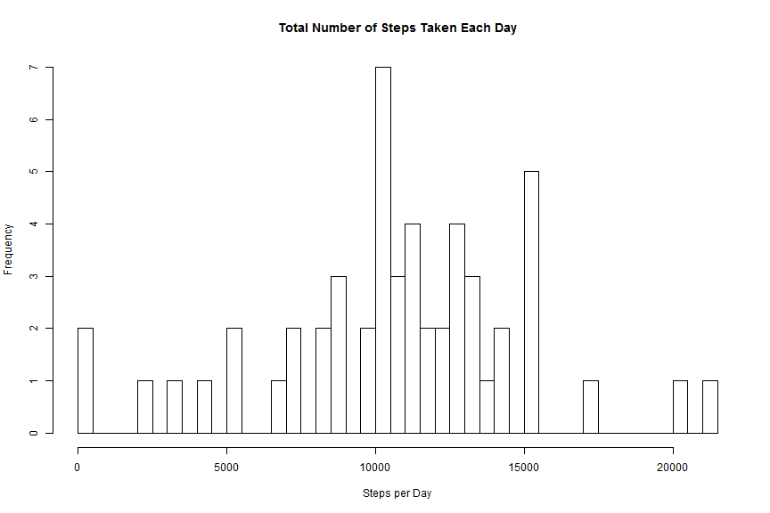
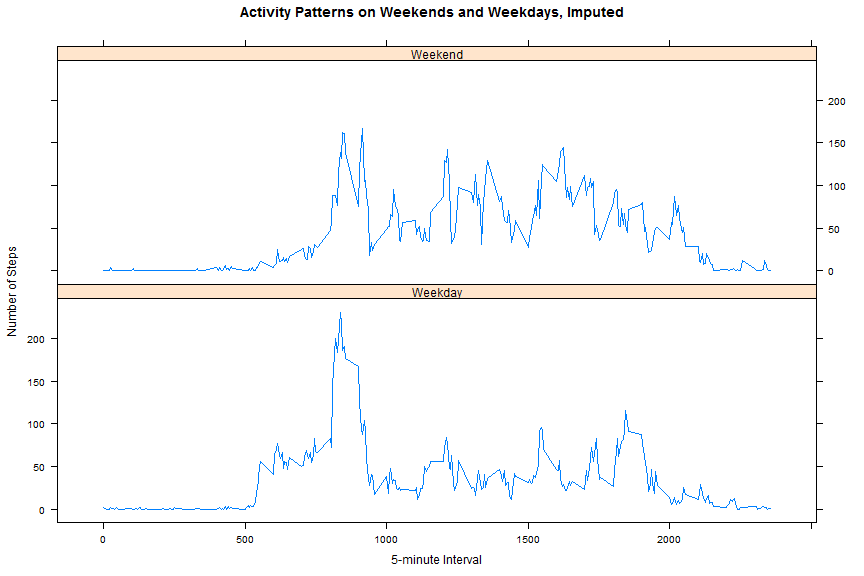

## Setup


```r
require(knitr)
opts_chunk$set(fig.width=12, fig.height=8, fig.path='./figure',
               echo=TRUE, warning=FALSE, message=FALSE)
```

## Loading and preprocessing the data

Show any code that is needed to:

* Load the data (i.e. read.csv())
* Process/transform the data (if necessary) into a format suitable for your analysis

The file for this project was downloaded on 11/8/2014 10:17 AM from http://github.com/rdpeng/RepData_PeerAssessment1.


```r
dir.create("data")
unzip("activity.zip", exdir = "./data", overwrite=TRUE)
activity <- read.csv("./data/activity.csv", na.strings = "NA")
dir.create("figure")
```

Get some basic information about the file.


```r
summary(activity)
```

```
##      steps               date          interval   
##  Min.   :  0.0   2012-10-01:  288   Min.   :   0  
##  1st Qu.:  0.0   2012-10-02:  288   1st Qu.: 589  
##  Median :  0.0   2012-10-03:  288   Median :1178  
##  Mean   : 37.4   2012-10-04:  288   Mean   :1178  
##  3rd Qu.: 12.0   2012-10-05:  288   3rd Qu.:1766  
##  Max.   :806.0   2012-10-06:  288   Max.   :2355  
##  NA's   :2304    (Other)   :15840
```

```r
head(activity)
```

```
##   steps       date interval
## 1    NA 2012-10-01        0
## 2    NA 2012-10-01        5
## 3    NA 2012-10-01       10
## 4    NA 2012-10-01       15
## 5    NA 2012-10-01       20
## 6    NA 2012-10-01       25
```

```r
tail(activity)
```

```
##       steps       date interval
## 17563    NA 2012-11-30     2330
## 17564    NA 2012-11-30     2335
## 17565    NA 2012-11-30     2340
## 17566    NA 2012-11-30     2345
## 17567    NA 2012-11-30     2350
## 17568    NA 2012-11-30     2355
```

## Processing prior to Imputing Missing Values

For this part of the assignment, you can ignore the missing values in the dataset.

* What is mean total number of steps taken per day?

```r
total_steps <- aggregate(steps ~ date, data = activity, FUN = sum)
# Based upon the comments by the TA in the Discussion Forums, these calculations
# are not used.
mean_steps <- aggregate(steps ~ date, data = activity, FUN = mean)
median_steps <- aggregate(steps ~ date, data = activity, FUN = median)
# The forums indicate that these are the correct calculations.
mean_total_steps <- mean(total_steps$steps)
median_total_steps <- median(total_steps$steps)
```

* Make a histogram of the total number of steps taken each day


```r
hist(total_steps$steps, 
     breaks = nrow(total_steps), 
     main = "Total Number of Steps Taken Each Day", 
     xlab = "Steps per Day")
```

 

```r
# dev.copy(png, 
#          filename = "./figure/plot1.png", 
#          width = 480, 
#          height = 480, 
#          units = "px", 
#          bg = "white")
# dev.off()
```

* Calculate and report the mean and median total number of steps taken per day

The mean of total number of steps taken per day is 10,766

The median of total number of steps taken per day is 10,765

* What is the average daily activity pattern?

* Make a time series plot (i.e. type = "l") of the 5-minute interval (x-axis) and the average number of steps taken, averaged across all days (y-axis)


```r
time_series_average <- aggregate(steps ~ interval, data = activity, FUN = mean)

plot(x = time_series_average$interval,
y = time_series_average$steps,
type = 'l',
main = "Average Daily Activity Pattern", 
xlab = "5-minute Interval", 
ylab = "Average Number of Steps Taken")
```

 

* Which 5-minute interval, on average across all the days in the dataset, contains the maximum number of steps?


```r
max_interval <- time_series_average[which.max(time_series_average$steps),
                                   "interval"]
```

The 5-minute interval that contains the maximum number of steps is 835

Comments:  I didn't really like the whole 5-minute interval thing.  Given that
           there should be 12 intervals per hour and 288 intervals per day, we
           should be able to guess, within a period of 5 minutes, when the 
           device was turned on and then convert the interval to a time of day.
           It would have been more interesting to figure out when the user was
           most active and see if we could determine any other activity patterns
           from the data.

## Imputing missing values

Note that there are a number of days/intervals where there are missing values (coded as NA). The presence of missing days may introduce bias into some calculations or summaries of the data.

* Calculate and report the total number of missing values in the dataset (i.e. the total number of rows with NAs)


```r
missing_count <- sum(is.na(activity$steps)) #This better match the summary
```

The total number of missing values is 2,304

* Devise a strategy for filling in all of the missing values in the dataset. The strategy does not need to be sophisticated. For example, you could use the mean/median for that day, or the mean for that 5-minute interval, etc.

Comments:  This was an interesting part of the assignment, at least from a
           research perspective (it remains to be seen whether I can actually
           use any of the items I discovered.)  There seems to be several
           missing data imputation packages that are available:
           
        Visualization and Imputation of Missing values -- Templ, M., Alfons, A., & Kowarik, A. (2010a). Package available at http://cran.r-project.org/web/packages/VIM/VIM.pdf
           
        Amelia II -- Honaker, J., King, G., & Blackwell, M. (2010a). Package available at http://cran.r-project.org/web/packages/Amelia/Amelia.pdf
           
        mvnmle -- Gross, K., & Bates, D. (2009). Package available at http://cran.r-project.org/web/packages/mvnmle/mvnmle.pdf
           
        k nearest neighbor (knn) -- Kim, K., & Yi, G. (2009). Package available at http://cran.r-project.org/web/packages/SeqKnn/SeqKnn.pdf
        
        Stack Overflow had several examples of doing various things to replace missing values -- http://stackoverflow.com 

* Create a new dataset that is equal to the original dataset but with the missing data filled in.

I'm going to try using the Amelia II package just to see how it works.  The documentation indicates that there is a user interfact that is used to generate the output files.  I hope that I won't be penalized if that is the case and I just get an output file to use.


```r
require(Amelia) #Going to try this to see what happens.
activity$date<-as.Date(activity$date)
amelia_out <- amelia(activity, m = 5, p2s = 1, )
```

```
## -- Imputation 1 --
## 
##   1  2
## 
## -- Imputation 2 --
## 
##   1  2
## 
## -- Imputation 3 --
## 
##   1  2
## 
## -- Imputation 4 --
## 
##   1  2
## 
## -- Imputation 5 --
## 
##   1  2
```

```r
summary(amelia_out)
```

```
## 
## Amelia output with 5 imputed datasets.
## Return code:  1 
## Message:  Normal EM convergence. 
## 
## Chain Lengths:
## --------------
## Imputation 1:  2
## Imputation 2:  2
## Imputation 3:  2
## Imputation 4:  2
## Imputation 5:  2
## 
## Rows after Listwise Deletion:  15264 
## Rows after Imputation:  17568 
## Patterns of missingness in the data:  2 
## 
## Fraction Missing for original variables: 
## -----------------------------------------
## 
##          Fraction Missing
## steps              0.1311
## date               0.0000
## interval           0.0000
```

```r
missmap(amelia_out)
```

 

```r
summary(amelia_out$imputations[[5]])
```

```
##      steps             date               interval   
##  Min.   :-318.7   Min.   :2012-10-01   Min.   :   0  
##  1st Qu.:   0.0   1st Qu.:2012-10-16   1st Qu.: 589  
##  Median :   0.0   Median :2012-10-31   Median :1178  
##  Mean   :  36.9   Mean   :2012-10-31   Mean   :1178  
##  3rd Qu.:  26.0   3rd Qu.:2012-11-15   3rd Qu.:1766  
##  Max.   : 806.0   Max.   :2012-11-30   Max.   :2355
```

**Well, that was an interesting experiement.  Somehow I think that if I complete the assignment with the Amelia II output and plot negative steps, someone will probably give me a poor evaluation.  I'm going to leave this in because it does show some intersting data (and maybe that I don't know what I'm doing), but from this point on I will be doing something more conventional.**

Replaced the missing values with the mean.  I don't like this much better because it includes fractional steps.


```r
imputed_activity <- activity #Make a copy
imputed_activity$steps[is.na(imputed_activity$steps)] <- tapply(imputed_activity$steps, imputed_activity$interval, mean, na.rm = T)
```

* Make a histogram of the total number of steps taken each day and Calculate and report the mean and median total number of steps taken per day. Do these values differ from the estimates from the first part of the assignment? What is the impact of imputing missing data on the estimates of the total daily number of steps? 


```r
imputed_total_steps <- aggregate(steps ~ date, 
                                 data = imputed_activity, 
                                 FUN = sum)
imputed_mean_total_steps <- mean(imputed_total_steps$steps)
imputed_median_total_steps <- median(imputed_total_steps$steps)
hist(imputed_total_steps$steps, 
     breaks = nrow(total_steps), 
     main = "Total Number of Steps Taken Each Day, Imputed", 
     xlab = "Imputed Steps per Day")
```

 

```r
# dev.copy(png, 
#          filename = "./figure/plot2.png", 
#          width = 480, 
#          height = 480, 
#          units = "px", 
#          bg = "white")
# dev.off()
```

The imputed mean of total number of steps taken per day is 10,766 and the difference is 'r imputed_mean_total_steps - mean_total_steps`

The imputed median of total number of steps taken per day is 10,766 and the difference is 'r imputed_median_total_steps - median_total_steps`

* Are there differences in activity patterns between weekdays and weekends?

For this part the weekdays() function may be of some help here. Use the dataset with the filled-in missing values for this part.

* Create a new factor variable in the dataset with two levels – “weekday” and “weekend” indicating whether a given date is a weekday or weekend day.


```r
imputed_activity$date <- as.Date(imputed_activity$date)
imputed_activity$dayofweek <- weekdays(imputed_activity$date)
imputed_activity$weekend <- factor(imputed_activity$dayofweek 
                                   %in% c("Saturday", "Sunday"), 
                                   labels = c("Weekday", "Weekend"))
```

* Make a panel plot containing a time series plot (i.e. type = "l") of the 5-minute interval (x-axis) and the average number of steps taken, averaged across all weekday days or weekend days (y-axis). See the README file in the GitHub repository to see an example of what this plot should look like using simulated data.


```r
activity_by_interval <- aggregate(imputed_activity$steps,
                                  list("interval" = imputed_activity$interval,
                                       "weekend" = imputed_activity$weekend),
                                  mean, na.rm = TRUE, 
                                  simplify = TRUE)
require(lattice)
xyplot(activity_by_interval$x ~ activity_by_interval$interval 
       | activity_by_interval$weekend, 
       type = "l",
       layout = c(1,2),
       xlab = "5-minute Interval",
       ylab = "Number of Steps",
       main = "Activity Patterns on Weekends and Weekdays, Imputed")
```

 

```r
# dev.copy(png, 
#          filename = "./figure/plot3.png", 
#          width = 480, 
#          height = 480, 
#          units = "px", 
#          bg = "white")
# dev.off()
```

## Submitting the Assignment

To submit the assignment:

* Commit the your completed PA1_template.Rmd file to the master branch of your git repository (you should already be on the master branch unless you created new ones)

* Commit your PA1_template.md and PA1_template.html files produced by processing your R markdown file with knit2html() function in R (from the knitr package) by running the function from the console.

+ If your document has figures included (it should) then they should have been placed in the figure/ directory by default (unless you overrided the default). Add and commit the figure/ directory to yoru git repository so that the figures appear in the markdown file when it displays on github.

* Push your master branch to GitHub.

+ Submit the URL to your GitHub repository for this assignment on the course web site.

+ In addition to submitting the URL for your GitHub repository, you will need to submit the 40 character SHA-1 hash (as string of numbers from 0-9 and letters from a-f) that identifies the repository commit that contains the version of the files you want to submit. You can do this in GitHub by doing the following


```r
sessionInfo()
```

```
## R version 3.1.2 Patched (2014-11-05 r66942)
## Platform: x86_64-w64-mingw32/x64 (64-bit)
## 
## locale:
## [1] LC_COLLATE=English_United States.1252 
## [2] LC_CTYPE=English_United States.1252   
## [3] LC_MONETARY=English_United States.1252
## [4] LC_NUMERIC=C                          
## [5] LC_TIME=English_United States.1252    
## 
## attached base packages:
## [1] stats     graphics  grDevices utils     datasets  methods   base     
## 
## other attached packages:
## [1] lattice_0.20-29         Amelia_1.7.2            RcppArmadillo_0.4.500.0
## [4] Rcpp_0.11.3             foreign_0.8-61          knitr_1.6              
## 
## loaded via a namespace (and not attached):
##  [1] digest_0.6.4     evaluate_0.5.5   formatR_1.0      grid_3.1.2      
##  [5] htmltools_0.2.6  packrat_0.4.1-1  rmarkdown_0.2.64 stringr_0.6.2   
##  [9] tools_3.1.2      yaml_2.1.13
```
